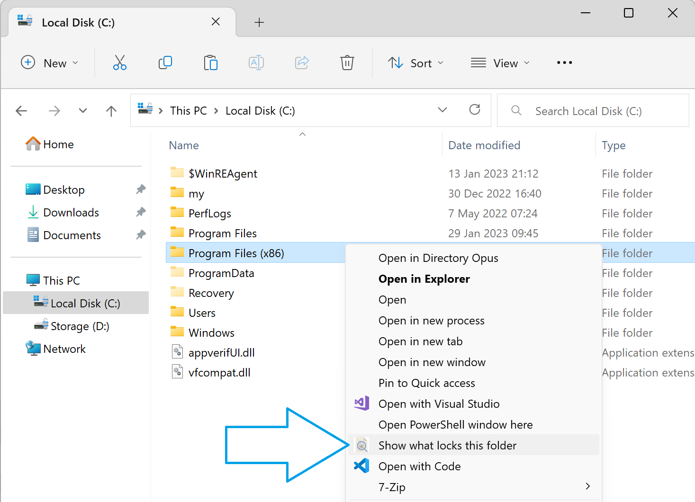

# ShowWhatProcessLocksFile
An utility to discover what processes lock a specific file or folder. 

# Screenshots
## Context menu

## The application

# System requirements
* .Net Framework 4.6.1 or higher (Windows 10 already has it)
* The user should be allowed to run applications as an Administrator.

# How it works
The application uses [Handle by Mark Russinovich](https://docs.microsoft.com/en-us/sysinternals/downloads/handle) to get information about locking processes. The output of `handle.exe` is parsed and displayed in the GUI. 

# How to use
* Download `ShowWhatProcessLocksFile.msi.zip` from the latest [release](https://github.com/PolarGoose/ShowWhatProcessLocksFile/releases).
* Run the installer. The installer will install this programm to the `%AppData%\ShowWhatProcessLocksFile` folder and add a "Show what locks this file" Windows File Explorer context menu element.
* Use "Show what locks this file" File Explorer's context menu to select a file or folder
* To terminate selected processes, open a context menu by clicking mouse right button
* If you want to uninstall the program, use `Control Panel\Programs\Programs and Features`, uninstaller will remove an integration with the context menu and all files which were installed.

# How to build
* Use `Visual Studio 2019` with [Wix Toolset Visual Studio 2019 Extension](https://marketplace.visualstudio.com/items?itemName=WixToolset.WixToolsetVisualStudio2019Extension) and [Wix Toolset](https://wixtoolset.org/releases/).
* Run `.github\workflows\build.ps1` to build a release (`git.exe` should be in your PATH)

# References
* This tool is inspired by [LockHunter](https://lockhunter.com/)
* Article about API used by `Handle.exe` with code samples: [Examine Information on Windows NT System Level Primitives](https://www.codeguru.com/cpp/w-p/system/processesmodules/article.php/c2827/Examine-Information-on-Windows-NT-System-Level-Primitives.htm)
